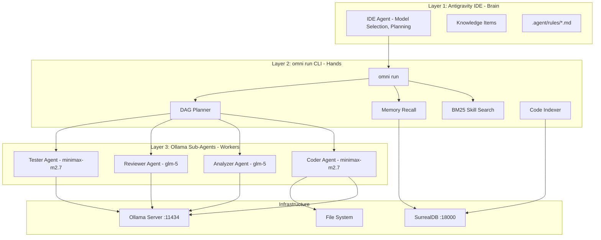
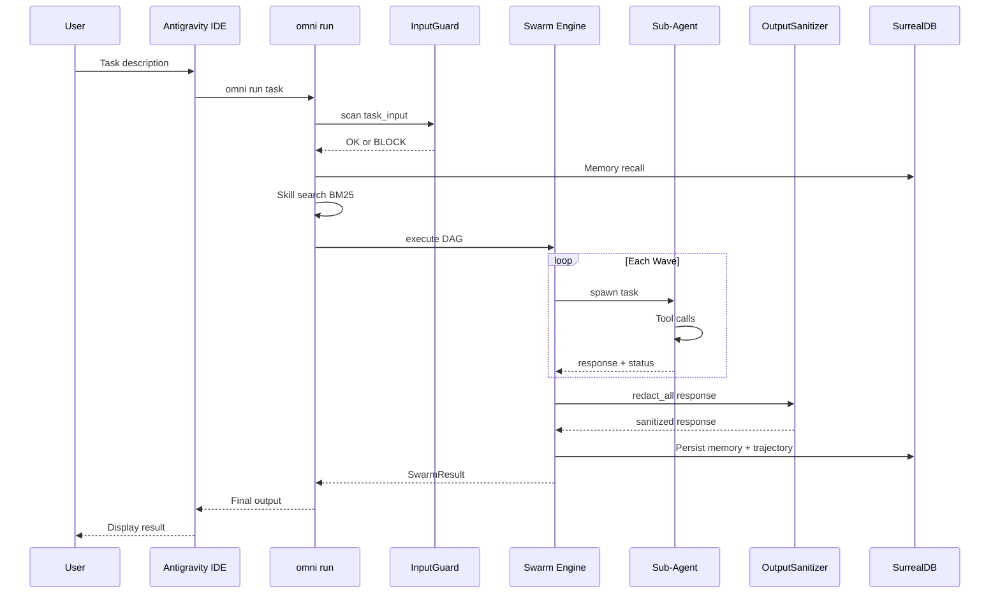
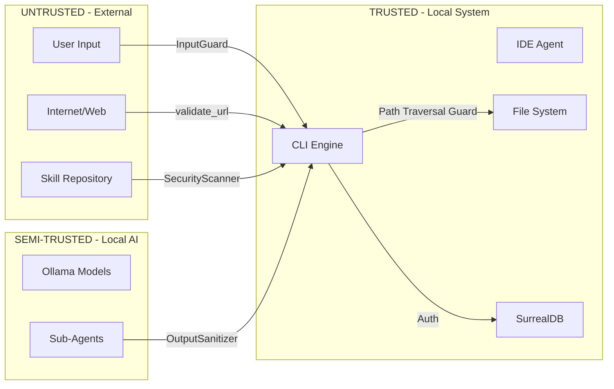

# Architecture — OmniUltraAgent Kit

> Version: 1.0 | Last Updated: 2026-03-29

## System Overview

OmniUltraAgent Kit is a three-layer AI agent orchestration system that combines a powerful IDE brain with local Ollama-powered sub-agents for autonomous code generation, analysis, and review.

## Data Flow: Request to Response

## Trust Boundaries

### Security Layers by Trust Boundary

| Boundary | Guard | Controls |
|----------|-------|----------|
| User to System | **InputGuard** | 41 patterns, encoding normalization, CJK detection, padding detection |
| Agent to User | **OutputSanitizer** | Credential redaction, PII detection, path disclosure, markdown exfil |
| Agent to File System | **Path Traversal** | Project root scoping, .. blocking, .bak backups |
| Agent to Network | **URL Validator** | Localhost/private IP blocking, query param exfil detection |
| Agent to Agent | **LoopGuard** | Rate limiting, ping-pong detection, tool chaining guard |
| Skill to Agent | **SecurityScanner** | 5-category scan: injection, secrets, file ops, network, privesc |
| DAG to Swarm | **DAG Validator** | Max 25 tasks, cycle detection, concurrency limiter max 3 |
| Agent to Brain | **DriftTracker** | Cosine drift detection, consecutive escalation |

## Component Architecture

| Component | File | Purpose |
|-----------|------|---------|
| InputGuard | src/core/input_guard.rs | Pre-processing defense: normalize + pattern scan |
| OutputSanitizer | src/core/output_sanitizer.rs | Post-processing defense: credential + PII + exfil redaction |
| LoopGuard | src/agents/loop_guard.rs | Runtime defense: dedup, rate limit, tool chaining |
| DriftTracker | src/agents/drift.rs | Semantic defense: multi-turn topic drift detection |
| SecurityScanner | src/skills/security_scanner.rs | Supply chain defense: 5-category skill scanning |
| Swarm Engine | src/agents/swarm.rs | DAG execution: wave resolution, concurrency control |
| AgenticRunner | src/agents/runner/ | Individual agent lifecycle: prompt to tool loop to response |
| BM25Engine | src/skills/search.rs | Skill retrieval: tokenization, BM25 scoring, diversity |
| SurrealClient | src/db/surreal.rs | Brain persistence: memory, trajectories, code elements |
| Regression | src/core/regression.rs | Automated testing: 26-vector adversarial suite |

---

*See also: .agent/security/compliance/ai-policy.md | .agent/security/compliance/risk-register.md | .agent/security/blue/compliance-report.md*
