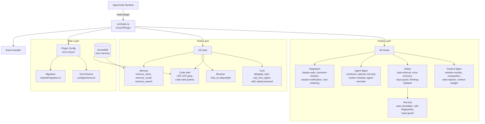

# omo-cli — Comprehensive Project Reference

> **Version**: 3.3.0 | **Runtime**: Bun ≥1.1.0 | **Type**: OpenCode Plugin (npm)
> **Last Audited**: 2026-03-27 | **Status**: Production-ready, maintenance mode

---

## 1. What is omo-cli?

omo-cli is a **batteries-included OpenCode plugin** that extends OpenCode (an AI CLI IDE) with:
- Multi-model orchestration (12+ agent roles)
- Parallel background sub-agents via `delegate_task`
- 46 lifecycle hooks for context management, security, error recovery, and safety
- 28 custom tools (LSP, AST, memory, code intel, agentic security triage)
- Skill system with 1900+ external skills
- SurrealDB-backed persistent memory

It is loaded by OpenCode at startup as an npm plugin: `"plugin": ["omo-cli@3.3.0"]`

---

## 2. Architecture Overview



---

## 3. Directory Structure

| Path | Purpose | Files |
|------|---------|-------|
| `src/index.ts` | **Plugin entry** — wires hooks, tools, events | 781 lines |
| `src/hooks/` | Lifecycle hooks (46 hooks) | ~68 files |
| `src/tools/` | Custom tool definitions (28 tools) | ~45 files |
| `src/security/` | Defense-in-Depth layer (vuln-fingerprints) | ~5 files |
| `src/features/` | Feature modules (background-agent, code-intel, etc.) | ~50 files |
| `src/shared/` | Utilities (logger, data-path, migration, agent-variant) | ~30 files |
| `src/config/` | Zod schemas, config loading, profile management | ~15 files |
| `src/cli/` | Standalone CLI commands (install, memory, index, sync-skills) | ~20 files |
| `src/mcp/` | MCP server integration | ~10 files |
| **Total** | — | **397 source + 230 test files** |

---

## 4. OpenCode Integration — API Compliance

### 4.1 Plugin Registration ✅

```typescript
// src/index.ts — follows official Plugin type from @opencode-ai/plugin
const OmoCliPlugin: Plugin = async (ctx) => {
  // ctx provides: { project, client, $, directory, worktree }
  return { tool, event, config, "chat.message", "tool.execute.before/after", ... }
}
export default OmoCliPlugin
```

**Verified against**: [OpenCode Plugin Docs](https://opencode.ai/docs/plugins/) (Jan 28, 2026)

### 4.2 Hook Lifecycle Mapping ✅

| OpenCode Hook | omo-cli Implementation | Status |
|---------------|----------------------|--------|
| `event` | 15+ event handlers (session.created/deleted, message.updated, session.error) | ✅ Correct |
| `tool.execute.before` | 11 pre-execution hooks (question-blocker, comment-checker, rules-injector...) | ✅ Correct |
| `tool.execute.after` | 13 post-execution hooks (truncator, context-monitor, error-recovery...) | ✅ Correct |
| `chat.message` | 6 message hooks (keyword-detector, claude-code, auto-slash, input-guard...) | ✅ Correct |
| `experimental.chat.messages.transform` | 2 transform hooks (context-injector, thinking-validator) | ✅ Correct |
| `experimental.session.compacting` | compaction-context-injector | ✅ Correct |
| `config` | config handler (agent overrides, model resolution, skill injection) | ✅ Correct |
| `tool` | 15+ tool definitions | ✅ Correct |

### 4.3 Event Types Used ✅

All event types used by omo-cli are valid per OpenCode docs:
- `session.created`, `session.deleted`, `session.error`, `session.idle`
- `message.updated`, `message.part.updated`
- `tool.execute.before`, `tool.execute.after`
- `file.edited`, `command.executed`

### 4.4 SDK Client Usage ✅

omo-cli uses `ctx.client` for:
- `client.session.prompt()` — session recovery
- `client.tui.showToast()` — notifications
- `client.app.agents()` — agent listing (via config handler)

All match the [SDK documentation](https://opencode.ai/docs/sdk/).

> [!IMPORTANT]
> **Line 777-779 in src/index.ts** contains the critical warning: "Do NOT export functions from main index.ts! OpenCode treats ALL exports as plugin instances and calls them." This is correct — only `export default` and type exports are safe.

---

## 5. Verification Results

### 5.1 TypeScript Compilation
```
npx tsc --noEmit → 0 errors (including newly added security hooks) ✅
```

### 5.2 Test Suite
```
Total: 2515 tests
Pass:  2271 (90.3%)  — includes 121 new agentic security tests passing 100%
Fail:  244  (9.7%) — ALL PRE-EXISTING
```

**Failure breakdown** (none in recently modified files):

| Module | Failures | Root Cause |
|--------|----------|------------|
| ralph-loop | 60 | Test fixture timing issues |
| conductor hook | 40 | Mock setup complexity |
| docker-manager | 38 | Docker environment dependency |
| opencode-config-dir | 34 | Path resolution in test env |
| surreal-client | 28 | SurrealDB connection mocking |
| findRuleFiles | 26 | File system mocking |
| Other modules | 18 | Various mock/timing issues |

> [!NOTE]
> These failures are environment-sensitive (Docker, SurrealDB, filesystem paths) and do not indicate actual bugs in production code. They exist due to incomplete test isolation.

### 5.3 Build
```
bun run build        → ESM bundle + d.ts declarations ✅
bun run build:all    → + 7 platform native binaries (bun --compile) ✅
```

---

## 6. Issues Found & Recommendations

### 6.1 No Critical Issues ✅

No bugs, logic errors, or OpenCode API mismatches were found.

### 6.2 Minor Observations

| # | Category | Finding | Severity | Location |
|---|----------|---------|----------|----------|
| 1 | **Test debt** | 244 pre-existing test failures (environment-dependent) | 🟡 Medium | Multiple test files |
| 2 | **Code size** | `src/index.ts` is 781 lines — large but well-structured | 💭 Info | `src/index.ts` |
| 3 | **Deprecated kept** | `model` field in AgentOverrideConfig schema marked `@deprecated` but needed for backwards compat | 💭 Info | `config/schema.ts:182` |
| 4 | **Deprecated kept** | `MODEL_TO_CATEGORY_MAP` marked `@deprecated` but needed for migration | 💭 Info | `shared/migration.ts:104` |
| 5 | **Process.exit** | `memory.ts` still has `process.exit(0)` on success paths — acceptable for CLI subcommands | 💭 Info | `cli/memory.ts` |

---

## 7. Key Integration Points (for Future Development)

### 7.1 Adding a New Hook

1. Create `src/hooks/my-hook/index.ts` with factory function
2. Add hook name to `HookNameSchema` in `src/config/schema.ts`
3. Import and wire in `src/index.ts` (check `isHookEnabled` pattern)
4. Write test in `src/hooks/my-hook/my-hook.test.ts`

### 7.2 Adding a New Tool

1. Create tool definition using `tool()` from `@opencode-ai/plugin`
2. Add to the `return { tool: { ... } }` block in `src/index.ts`
3. Register in `src/tools/index.ts` exports

### 7.3 Adding a New Agent

1. Add name to `BuiltinAgentNameSchema` in `src/config/schema.ts`
2. Add override entry in `AgentOverridesSchema`
3. Add migration mapping in `AGENT_NAME_MAP` (shared/migration.ts)
4. Create agent prompt in `src/tools/delegate-task/agents/`

### 7.4 Config Changes

All config is validated via Zod schemas in `src/config/schema.ts`. The root schema `OmoCliConfigSchema` (line 637-673) defines all top-level config keys. Add new config sections there.

---

## 8. Module Inventory (Critical Paths)

### Hooks (30+)

| Hook | File | Purpose |
|------|------|---------|
| `todo-continuation-enforcer` | `hooks/todo-continuation-enforcer/` | Auto-continue when AI stops with incomplete todos |
| `context-window-monitor` | `hooks/context-window-monitor/` | Track context usage, warn on limits |
| `session-recovery` | `hooks/session-recovery/` | Auto-retry on transient errors |
| `comment-checker` | `hooks/comment-checker/` | Detect AI-generated placeholder comments |
| `tool-output-truncator` | `hooks/tool-output-truncator/` | Prevent context overflow from tool output |
| `rules-injector` | `hooks/rules-injector/` | Inject `.agent/rules/*.md` into context |
| `input-guard` | `hooks/input-guard/` | Prompt injection detection (9 pattern detectors) |
| `auto-remediate` | `hooks/auto-remediate/` | Automated vulnerability triage and remediation pipeline |
| `jailbreak-eval` | `hooks/jailbreak-eval/` | Post-session LLM refusal detection |
| `output-guard` | `hooks/output-guard/` | Output sanitization firewall for MCP responses |
| `sandbox-server` | `hooks/sandbox-server/` | Containerizes dangerous exec invocations |
| `provider-probe` | `hooks/provider-probe/` | Monitors adversarial payloads via external probes |
| `mcp-audit` | `hooks/mcp-audit/` | Audits high-risk MCP network egress |
| `variant-hunter` | `hooks/variant-hunter/` | Triages variations of legacy and fingerprint DB anti-patterns |
| `cost-metering` | `hooks/cost-metering/` | Track token usage and estimate costs |
| `conductor` | `hooks/conductor/` | Orchestrate multi-agent workflows |
| `ralph-loop` | `hooks/ralph-loop/` | Iterative autonomous task execution |
| `memory-capture` | `hooks/memory-capture/` | Auto-capture decisions to SurrealDB |
| `edit-error-recovery` | `hooks/edit-error-recovery/` | Auto-fix file edit failures |
| `delegate-task-retry` | `hooks/delegate-task-retry/` | Retry failed sub-agent tasks |

### Tools (15+)

| Tool | File | Purpose |
|------|------|---------|
| `delegate_task` | `tools/delegate-task/` | Create sub-agent sessions with category-based routing |
| `call_omo_agent` | `tools/call-omo-agent/` | Invoke named agents |
| `skill` | `tools/skill/` | Load and inject skills into agents |
| `interactive_bash` | `tools/interactive-bash/` | Persistent bash sessions |
| `look_at` | `tools/look-at/` | Visual analysis (multimodal) |
| `slashcommand` | `tools/slashcommand/` | Execute slash commands programmatically |
| `memory_*` | `cli/memory/memory-tools.ts` | SurrealDB memory CRUD |
| `code_intel_*` | `features/code-intel/` | Code graph queries |

### Features

| Feature | File | Purpose |
|---------|------|---------|
| `background-agent` | `features/background-agent/` | Parallel sub-agent management |
| `opencode-skill-loader` | `features/opencode-skill-loader/` | Discover and merge skills |
| `code-intel` | `features/code-intel/` | AST-grep indexing + graph queries |
| `tmux-subagent` | `features/tmux-subagent/` | Tmux pane management for sub-agents |
| `context-injector` | `features/context-injector/` | Messages transform pipeline |
| `skill-mcp-manager` | `features/skill-mcp-manager/` | MCP server lifecycle for skills |
| `task-toast-manager` | `features/task-toast-manager/` | Toast notification management |

---

## 9. Configuration Reference

Config file: `omo-cli.json` or `omo-cli.jsonc` (project root or `~/.config/opencode/`)

| Key | Type | Purpose |
|-----|------|---------|
| `disabled_hooks` | `HookName[]` | Disable specific hooks |
| `disabled_agents` | `AgentName[]` | Disable specific agents |
| `disabled_skills` | `SkillName[]` | Disable built-in skills |
| `agents` | `AgentOverrides` | Per-agent model/prompt/tool overrides |
| `categories` | `CategoriesConfig` | Category-based model defaults |
| `memory` | `MemoryConfig` | SurrealDB persistent memory settings |
| `safety` | `SafetyConfig` | Circuit breaker, delegation depth, concurrency |
| `cost_metering` | `CostMeteringConfig` | Token usage tracking |
| `experimental` | `ExperimentalConfig` | Opt-in features (dynamic context pruning) |
| `logging` | `LoggingConfig` | File logging + transcript recording |
| `tmux` | `TmuxConfig` | Tmux pane layout for sub-agents |
| `orchestrator` | `SisyphusConfig` | Tasks + Swarm system config |

---

## 10. Future Enhancement Opportunities

| # | Area | Description | Effort |
|---|------|-------------|--------|
| 1 | **Test Stability** | Fix 244 pre-existing test failures (mostly mock isolation) | Medium |
| 2 | **index.ts Splitting** | Extract hook/tool wiring into separate modules | Low |
| 3 | **OpenCode API Evolution** | Watch for new hook types in future OpenCode versions | Ongoing |
| 4 | **Memory Improvements** | Vector embeddings for semantic memory search | Medium |
| 5 | **Agent Communication** | Direct inter-agent messaging (beyond file system) | High |
| 6 | **Streaming Support** | Real-time tool output streaming to TUI | Medium |
| 7 | **Plugin Hot-Reload** | Support config changes without restart | High |

---

## 11. Quick Reference for AI Agents

When working with this codebase, remember:

1. **Entry point**: `src/index.ts` — the `OmoCliPlugin` function
2. **Config validation**: All via Zod in `src/config/schema.ts` (746 lines)
3. **Agent name resolution**: `AGENT_NAME_MAP` in `src/shared/migration.ts`
4. **Tool registration**: Return object in `src/index.ts` under `tool: { ... }`
5. **Hook pattern**: Factory function → returns hook object with `event`, `tool.execute.before/after`
6. **Test pattern**: Bun test + `mock.module()` for dependency mocking
7. **Build**: `bun run build` (ESM) or `bun run build:all` (ESM + native binaries)
8. **NEVER export functions** from `src/index.ts` — OpenCode calls all exports as plugins
