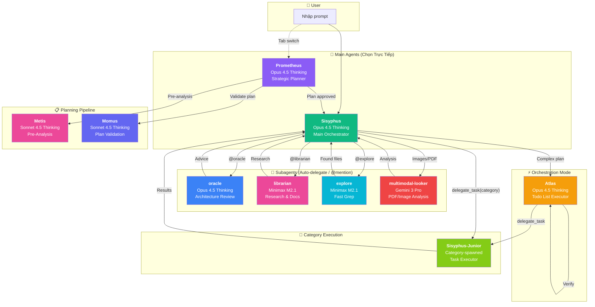
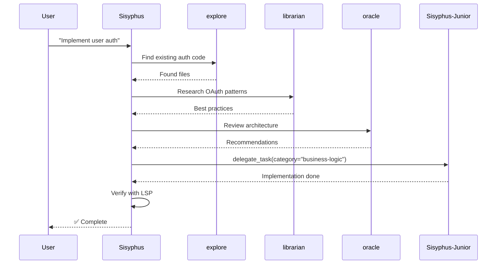
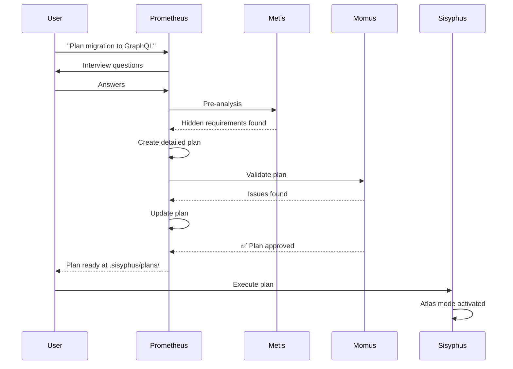
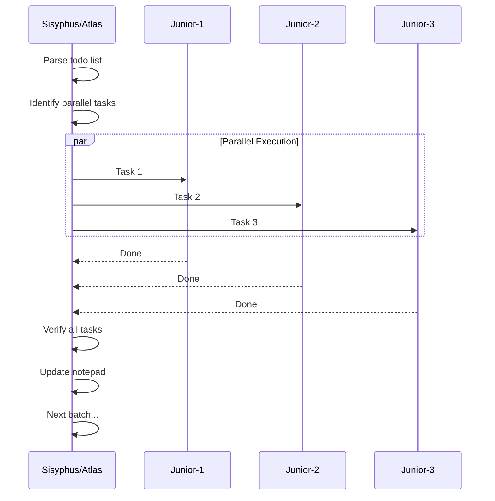

# Hướng Dẫn Sử Dụng oh-my-opencode — Custom Setup

> Tài liệu hướng dẫn chi tiết cho cấu hình cá nhân với 5 models: Claude Opus 4.5, Claude Sonnet 4.5 Thinking, Gemini 3 Pro, Gemini 3 Flash, và Minimax M2.1 (Ollama Cloud).

---

## Tổng Quan Setup

### Plugins Đã Cài

```
~/.config/opencode/
├── opencode.json          # Plugin order + provider definitions
├── oh-my-opencode.json    # Agent model overrides
└── antigravity-accounts.json  # Multi-account config (tự động tạo)
```

### Phân Bổ Model

| Model | Mục Đích | Agents/Categories |
|-------|----------|-------------------|
| **Claude Opus 4.5 Thinking** | Heavy lifting, orchestration, planning | Sisyphus, Prometheus, unspecified-high |
| **Claude Sonnet 4.5 Thinking** | Deep analysis, architecture | oracle |
| **Gemini 3 Pro** | Multimodal, visual tasks | multimodal-looker, visual-engineering |
| **Gemini 3 Flash** | Quick one-off tasks | quick, writing |
| **Minimax M2.1** | Coding workhorse, exploration | librarian, Metis, explore, business-logic |

### New Features from ClaudeKit Integration
- **Coding Level**: Adjustable verbosity (1-10) for Sisyphus.
- **Privacy Awareness**: Auto-detect sensitive files.
- **Improved Planning**: Prometheus now uses 5 Mental Models (Decomposition, 5 Whys, etc.).
- **New Skills**: `/watzup` (Project Status), `/docs` (Doc Management).

---

## Luồng Xử Lý Agents

### Sơ Đồ Tổng Quan



### Luồng Chi Tiết

#### 1. Luồng Mặc Định (Sisyphus)



#### 2. Luồng Planning (Prometheus)



#### 3. Luồng Orchestration (Atlas)



---

## Cách Sử Dụng

### 1. Bắt Đầu Làm Việc

Mở terminal và chạy:

```bash
opencode
```

Bạn sẽ thấy 2 agents có thể chọn trực tiếp:
- **Sisyphus** (default) — cho mọi task thông thường
- **Prometheus** — cho planning chi tiết với interview mode

### 2. Làm Việc Với Sisyphus (Default)

Chỉ cần chat bình thường. Sisyphus sẽ tự động:
- Phân tích yêu cầu
- Delegate cho subagents phù hợp
- Execute parallel khi có thể

```
# Ví dụ prompts
Implement a REST API for user authentication

Refactor this function to use async/await

Fix the memory leak in the database connection pool

ulw add dark mode to the settings page
```

> 💡 **Tip:** Thêm `ultrawork` hoặc `ulw` để kích hoạt maximum effort mode

### 3. Gọi Subagents Bằng @mention

#### @oracle — Strategic Advisor (Sonnet Thinking)

Dùng cho: architecture decisions, debugging strategy, code review

```
Ask @oracle to review this architecture and identify potential issues

Ask @oracle why is this function causing memory leaks?

Ask @oracle should I use Redux or Context for state management?
```

#### @librarian — Research (Minimax M2.1)

Dùng cho: documentation lookup, OSS examples, codebase understanding

```
Ask @librarian how other projects implement OAuth2 refresh token rotation

Ask @librarian find examples of rate limiting in Express.js

Ask @librarian what's the best practice for error handling in this codebase?
```

#### @explore — Fast Grep (Gemini 3 Flash)

Dùng cho: quick codebase exploration, finding files/functions

```
Ask @explore where is authentication implemented?

Ask @explore find all usages of the deprecated API

Ask @explore what files handle payment processing?
```

#### @multimodal-looker — Visual Content (Gemini 3 Pro)

Dùng cho: PDF, images, diagrams, screenshots

```
Ask @multimodal-looker analyze this screenshot and describe the UI layout

Ask @multimodal-looker extract text from this PDF diagram

Ask @multimodal-looker what's wrong with this error screenshot?
```

### 4. Planning Mode với Prometheus

Switch sang Prometheus bằng Tab, sau đó:

```
Create a detailed plan for migrating from REST to GraphQL

Plan the implementation of a real-time notification system

Design the database schema for a multi-tenant SaaS application
```

Prometheus sẽ:
1. Phỏng vấn để làm rõ yêu cầu
2. Gọi **Metis** (M2.1) để phân tích trước
3. Tạo plan chi tiết vào `.sisyphus/plans/`
4. Gọi **Momus** để validate plan

### 5. Background Execution

Chạy tasks song song trong khi tiếp tục làm việc:

```
# Spawn background agent
delegate_task(
  agent="explore",
  background=true,
  prompt="Find all files using deprecated v1 API"
)

# Continue working...

# Check results when ready
background_output(task_id="bg_abc123")
```

**Use cases:**
- GPT debug trong khi Claude thử approaches khác
- Gemini viết frontend song song Claude làm backend
- Massive parallel searches

### 6. Category-Based Delegation

Thay vì chỉ định agent, delegate theo category:

```
# Quick tasks → Gemini 3 Flash
delegate_task(category="quick", prompt="Check if tests pass")

# Complex reasoning → Sonnet Thinking
delegate_task(category="ultrabrain", prompt="Analyze complex algorithm")

# Backend coding → Minimax M2.1
delegate_task(category="business-logic", prompt="Implement the payment service")

# UI tasks → Gemini 3 Pro
delegate_task(category="visual-engineering", prompt="Create a responsive navbar")

# Documentation → Gemini 3 Flash
delegate_task(category="writing", prompt="Write API documentation")
```

---

## Skills

### playwright — Browser Automation

Tự động trigger cho browser tasks:

```
Take a screenshot of the login page and verify the layout

Run browser tests for the checkout flow

Scrape product data from this e-commerce page
```

### git-master — Git Operations

**PHẢI** dùng cho mọi git operations:

```
Commit these changes with proper atomic commits

Squash the last 3 commits into one

Find when this bug was introduced using git bisect

Rebase this branch onto main
```

### frontend-ui-ux — Design-to-Code

Designer persona cho stunning UI:

```
Create a stunning landing page with modern aesthetics

Improve the visual hierarchy of this dashboard

Design a mobile-first responsive layout
```

### Skills Library — 600+ Skills Tích Hợp

Oh My OpenCode cung cấp **600+ skills được tuyển chọn** từ antigravity-awesome-skills.

**Import nhanh:**
```bash
# Quét bảo mật tất cả skills
bunx oh-my-opencode scan-skills

# Phân loại theo agent và tier
bunx oh-my-opencode categorize-skills

# Cài đặt Tier 1 + 2 (479 skills, khuyến nghị)
bunx oh-my-opencode adapt-skills --max-tier 2
```

**Skill Tiers:**
| Tier | Skills | Chất lượng | Độ an toàn |
|------|--------|------------|------------|
| 1 | 85 | Xuất sắc | An toàn |
| 2 | 394 | Tốt | An toàn/Thấp |
| 3 | 100 | Trung bình | Trung bình |
| 4 | 36 | Cần review | Cao |

**Categories:** Architecture, DevOps, Frontend, Backend, AI/ML, Testing, Security, Documentation

---

## Tmux Integration

Nếu bạn dùng tmux, background agents sẽ hiển thị trong separate panes:

```bash
# Khởi động OpenCode trong tmux session
tmux new-session -s opencode
opencode
```

Xem multiple agents work real-time!

---

## Ollama Cloud — Minimax M2.1

Setup của bạn sử dụng Ollama client local gọi đến Ollama Cloud:

```bash
# Verify Ollama đang chạy
curl http://localhost:11434/api/tags | jq '.models[] | select(.name=="minimax-m2.1:cloud")'
```

**Lưu ý:**
- Compute xử lý ở cloud, không dùng GPU local
- Không có rate-limit như Anthropic/Google APIs
- Lý tưởng cho background tasks song song

---

## Anti-Patterns (Tránh Làm)

| ❌ Không | ✅ Nên |
|----------|--------|
| Trust "I'm done" reports | Verify outputs manually |
| Call Prometheus to write code | Let Sisyphus implement |
| Pick agents manually cho mọi task | Let Sisyphus orchestrate |
| Sequential exploration calls | Use background parallel delegates |
| Use high temperature (>0.3) | Keep low for code agents |

---

## Quick Reference

```bash
# Default work
[Chat với Sisyphus bình thường]

# Maximum effort
ulw [your prompt]

# Need planning
[Tab → Prometheus] hoặc @Prometheus create plan for [feature]

# Architecture review
Ask @oracle to review [topic]

# Research/examples
Ask @librarian how to [implement X]

# Find code
Ask @explore where is [feature]

# Analyze image/PDF
Ask @multimodal-looker what does this [image] show

# Background task
delegate_task(agent="explore", background=true, prompt="...")

# Category-based
delegate_task(category="quick", prompt="...")
delegate_task(category="business-logic", prompt="...")
delegate_task(category="visual-engineering", prompt="...")
```

---

## Troubleshooting

### Ollama Connection Error

```bash
# Check Ollama status
curl http://localhost:11434/api/tags

# Restart Ollama nếu cần
ollama serve
```

### Agent Not Found

Tên agent phải chính xác:
- PascalCase: `Sisyphus`, `Prometheus`, `Metis`, `Momus`, `Atlas`
- lowercase: `oracle`, `librarian`, `explore`, `multimodal-looker`

### Rate Limit Issues

Setup của bạn có multi-account rotation tự động. Nếu vẫn gặp issues:
- Chuyển tasks sang Minimax M2.1 (không rate-limit)
- Giảm `defaultConcurrency` trong `background_task`

---

## Config Files

### ~/.config/opencode/opencode.json

```json
{
  "plugin": ["opencode-antigravity-auth@latest", "oh-my-opencode@latest"],
  "provider": {
    "google": { "models": { ... } },
    "ollama": { "baseURL": "http://localhost:11434/v1", "models": { ... } }
  }
}
```

### ~/.config/opencode/oh-my-opencode.json

```json
{
  "google_auth": false,
  "agents": {
    "Sisyphus": { "model": "google/claude-opus-4-5" },
    "oracle": { "model": "google/claude-sonnet-4-5-thinking", "variant": "max" },
    "librarian": { "model": "ollama/minimax-m2.1:cloud", "stream": false },
    ...
  },
  "categories": { ... },
  "background_task": { "defaultConcurrency": 5 },
  "tmux": { "enabled": true }
}
```

---

*Tài liệu custom cho setup cá nhân • 2026-01-31*
